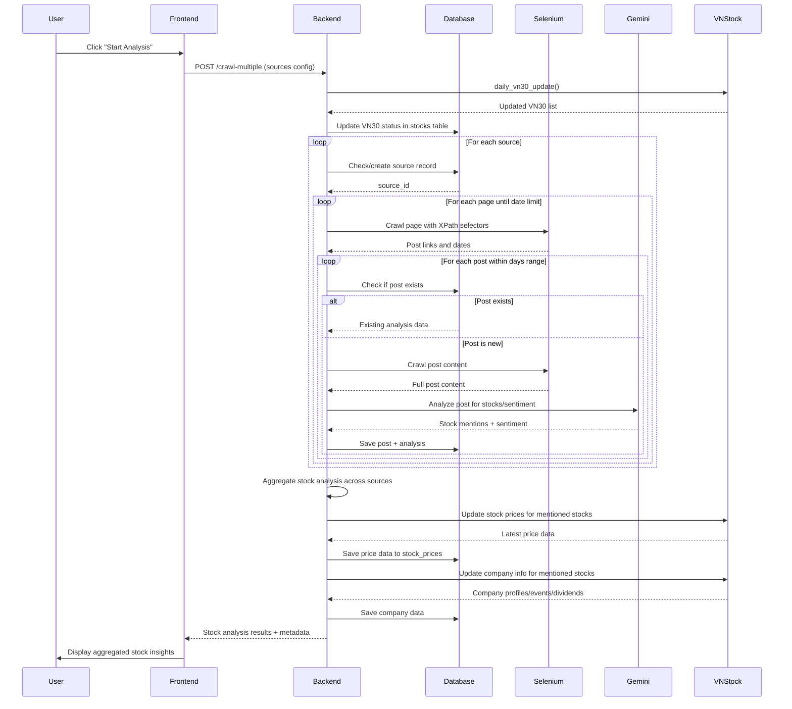

# System Workflow Documentation

This document describes the complete workflow when a user clicks "Start Analysis" in the Vietnamese Stock Analysis application.

## Overview

The system follows a multi-source crawling approach where users can configure multiple financial news sources and the system aggregates stock mentions and sentiment analysis across all sources.

## Detailed Workflow Steps

### Step 1: Frontend Initialization
- User configures multiple crawling sources on the frontend (static/index.html)
- User clicks "Start Analysis" button
- Frontend collects all source configurations and sends POST request to `/crawl-multiple` endpoint

### Step 2: Backend Request Processing
- **Endpoint**: `POST /crawl-multiple`
- **Location**: main.py:1084
- Backend validates MultipleCrawlRequest containing:
  - `sources`: Array of CrawlRequest objects
  - `days`: Number of days to crawl (default: 3)

### Step 3: Daily VN30 Update
- **Function**: `daily_vn30_update()` from daily_vn30_update.py
- Updates current VN30 stock list using vnstock library
- Updates `isvn30` column in stocks table to reflect current VN30 membership
- Ensures VN30 status is current for analysis and reporting

### Step 4: Multi-Source Processing Loop
For each source in the request:

#### Step 4.1: Source Database Management
- Check if source exists in database (`get_source_by_url()`)
- If not exists: Create new source record (`save_source()`)
- If exists: Use existing source_id

#### Step 4.2: Post Crawling
- **Function**: `crawl_posts()` from main.py:578
- Construct URLs with pagination rules
- Use Selenium WebDriver with stealth settings for web scraping
- Extract post links using configured XPath selectors
- Extract post dates and filter by specified days range

#### Step 4.3: Smart Content Processing
For each discovered post:
- Check if post exists in database (`check_post_exists()`)
- **If exists**: Retrieve existing analysis from database (no re-crawling)
- **If new**: 
  - Crawl full content using Selenium
  - Extract text content using configured XPath selectors
  - Clean and normalize text for AI processing

#### Step 4.4: AI Analysis
- **Function**: `analyze_individual_post_with_gemini()` from main.py:1004
- Send post content to Google Gemini AI (gemini-2.5-pro model)
- Extract Vietnamese stock mentions and sentiment analysis
- Return structured JSON with post summary and mentioned stocks

#### Step 4.5: Database Storage
- **Function**: `save_post_with_analysis()` from database.py
- Save new post to `posts` table
- Save mentioned stocks to `post_mentioned_stocks` table
- Update/create stock records in `stocks` table
- Aggregate daily sentiment in `stock_daily_sentiment` table

### Step 5: Stock-Level Aggregation
- Combine stock mentions across all sources
- Calculate overall sentiment per stock (majority wins)
- Count total mentions per stock
- Track which sources mention each stock
- Create comprehensive stock-level analysis

### Step 6: Stock Price Updates
- **Function**: `update_mentioned_stocks_prices()` from stock_price_updater.py
- Use vnstock library to fetch latest price data for mentioned stocks
- Optimize queries: only fetch from latest database date to today
- Save OHLCV data to `stock_prices` table with upsert handling

### Step 7: Company Information Updates
- **Function**: `update_company_information()` from company_info_updater.py
- Fetch company profiles, events, and dividends using vnstock
- Update company overview in `stocks` table
- Save events to `stock_events` table
- Save dividends to `stock_dividends` table

### Step 8: Response Generation
- Create comprehensive JSON response containing:
  - **posts**: All processed posts with analysis
  - **stock_analysis**: Stock-level aggregated analysis
  - **metadata**: Processing statistics and source breakdown
- Sort stocks by mention count (most mentioned first)
- Include source attribution and sentiment details

### Step 9: Frontend Display
- Receive JSON response from backend
- Update UI with stock analysis results
- Display aggregated stock sentiments
- Show source breakdown and statistics
- Present stock-level insights across all sources

## Mermaid Sequence Diagram

## Key Features

### Database Integration
- **Smart Deduplication**: Checks existing posts before crawling
- **Incremental Updates**: Only fetches new data since last update
- **Data Persistence**: All analysis results stored for future reference

### AI-Powered Analysis
- **Vietnamese Context**: Specialized prompts for Vietnamese financial news
- **Sentiment Analysis**: Positive/negative/neutral sentiment per stock
- **Stock Symbol Recognition**: Identifies Vietnamese stock symbols (HPG, ACB, etc.)

### Multi-Source Aggregation
- **Cross-Source Analysis**: Combines mentions from multiple news sources
- **Source Attribution**: Tracks which sources mention each stock
- **Weighted Sentiment**: Overall sentiment based on majority across sources

### Automated Data Updates
- **VN30 Status**: Daily updates of VN30 index membership
- **Stock Prices**: Automatic price updates for mentioned stocks
- **Company Data**: Events, dividends, and profile updates

## Error Handling

- **WebDriver Failures**: Fallback to requests library with stealth headers
- **AI API Errors**: Continue processing with error logging
- **Database Errors**: Graceful continuation with warning messages
- **Source Failures**: Process remaining sources and report failed ones

## Performance Optimizations

- **Driver Pool**: Reuses Chrome WebDriver instances (max 3)
- **Human-like Delays**: Random delays to avoid detection
- **Batch Processing**: Parallel tool calls where possible
- **Data Caching**: Database lookups to avoid redundant crawling

---

*This workflow ensures comprehensive, reliable, and efficient Vietnamese stock analysis across multiple financial news sources.*